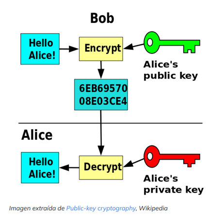

<p align="center">
    
</p>

# ¿Qué es RSA?
RSA es un algoritmo de cifrado asímétrico y, por tanto, trabaja con dos claves. Una clave pública y una clave privada.

Un texto plano, antes de transmitirlo al destinatario, podríamos cifrarlo con la clave pública. El receptor del mensaje, usando la clave privada, podría descifrar el mensaje. Esto también funciona a la inversa, es decir, si ciframos el mensaje con la clave privada podrá ser descifrado mediante la clave pública.

Espero que con la siguiente imagen, quede un poco más claro este concepto:
<p align="center">
    
</p>

Sin embargo, si alguien mal intencionado interceptara la comunicación, no podría ver el mensaje dado que no poseerá la clave para descifrarlo, salvo que consiga romper el cifrado. Y, esto último, me lleva al siguiente punto, la importancia de la longitud de las claves RSA.
<br>

# ¿Cómo podemos generar nuestra clave privada?
Para poder generar nuestra clave privada necesitaremos una serie de variables:

- "p" y "q": Son dos números primos.
- "n": Que es el resultado de multiplicar "p" y "q".
- "e": Suele ser un valor fijo, 65537
- "m": Que se obtiene de la fórmula n-(p+q-1)
- "d": Que es el resultado de realizar la operación modular multiplicativa inversa de "e" y "m". A continuación, veremos cómo podemos generar nuestra clave privada mediante Python y la librería Crypto.

Este sería el código completo de nuestro script, que genera nuestra clave privada.
```bash
#/usr/bin/env python3

from Crypto.PublicKey import RSA
from pwn import *

# Numeros primos
p=2425967623052370772757633156976982469681
q=1451730470513778492236629598992166035067

# n se obtiene del producto de "p" y "q"
n=p*q

# e es una valor fijo
e=65537

# m la obtenemos de la siguiente formula
m=n-(p+q-1)

# Definimos nuestra función modular multiplicativa inversa
# https://stackoverflow.com/questions/4798654/modular-multiplicative-inverse-function-in-python
def egcd(a, b):
    if a == 0:
        return (b, 0, 1)
    else:
        g, y, x = egcd(b % a, a)
        return (g, x - (b // a) * y, y)

def modinv(a, m):
    g, x, y = egcd(a, m)
    if g != 1:
        raise Exception('modular inverse does not exist')
    else:
        return x % m

# Función modular multiplicativa inversa
d=modinv(e, m)

key=RSA.construct((n, e, d, p, q))
print(key.exportKey().decode())
```


