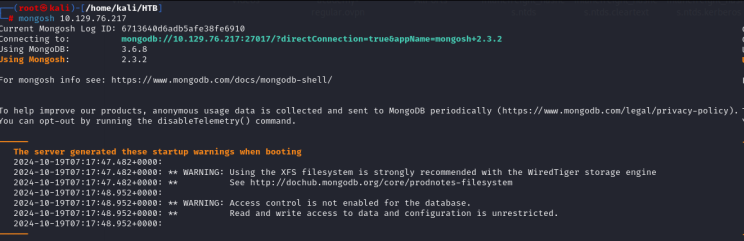
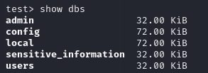
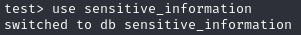
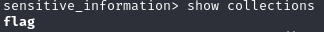
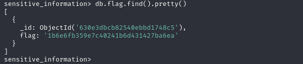

# Enumeración básica de un servicio MongoDB
Una buena enumeración es la base del éxito y la eficacia de un pentesting. En este artículo aprenderemos a realizar una enumeración básica de una base de datos NoSQL como es MongoDB.

Lo primero que necesitaremos es la instalación del cliente de MongoDB para poder conectarnos al servicio. A continuación, mostraremos los comandos a ejecutar para una máquina con sistema operativo Kali Linux:
```bash
$ sudo apt-get install gnupg
$ wget -qO- https://www.mongodb.org/static/pgp/server-8.0.asc | sudo tee /etc/apt/trusted.gpg.d/server-8.0.asc
$ echo "deb [ arch=amd64,arm64 ] https://repo.mongodb.org/apt/ubuntu jammy/mongodb-org/8.0 multiverse" | sudo tee /etc/apt/sources.list.d/mongodb-org-8.0.list
$ sudo apt-get update
$ sudo apt-get install -y mongodb-mongosh
```
Terminada la instalación, ya estamos en disposición de empezar con el proceso de enumeración. El siguiente paso será conectarnos al servicio de MongoDB. En nuestro ejemplo, el servicio no requiere de autenticación.
```bash
$ mongosh 10.129.76.217
```


Ahora, enumeraremos las bases de datos que el servicio de MongoDB tiene disponibles:
```bash
test> show dbs
```


Una base de datos en concreto parece especialmente interesante. La seleccionaremos para poderla enumerar más adelante:
```bash
test> use sensitive_information
```


Ahora, realizaremos un volcado de las colecciones de las que consta la base de datos "sensitive_information":
```bash
sensitive_information> show collections
```


Finalmente, podemos obtener todos los documentos que componen la colección ejecutando el siguiente comando (añadir .pretty() lo que permite es que el resultado devuelto sea más fácilmente leíble):
```bash
sensitive_information> db.flag.find().pretty()
```


Y con esto obtendríamos la ansiada flag 😃.


