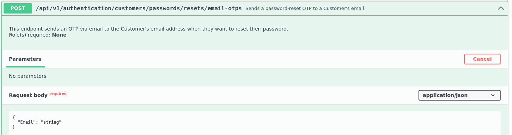

# Atacando a los sistemas de restablecimiento de contraseñas
Sabemos que las contraseñas son necesarias para la autenticación en diferentes tipos de sistemas. Las empresas, cada vez más por suerte, cuidan que sus políticas de contraseñas sean lo suficientemente robustas para forzar a sus empleados a que sigan las mejores prácticas e intentar impedir que un atacante pueda adivinirlas por fuerza bruta.

Sin embargo, es bastante común que las empresas pasen por alto securizar los mecanismos de restablecimiento de contraseñas que ofrecen a sus empleados, usados por ejemplo, ante un olvido de la misma. 

En este artículo, veremos cómo aprovecharnos de esta circunstancia en dos métodos frecuentemente usados: Preguntas/Respuestas y OTP.

# Preguntas/Respuestas

# OTP
Primero, explicaremos qué es OTP. OTP, del inglés One-Time Password, es una contraseña de un solo uso y, por tanto, pierde su validez después de su uso. Habitualmente, es usada como parte de de una autenticación de doble factor. Esta contraseña suele enviarse por correo electrónico o por SMS, para que pueda ser introducida por el interesado.

A continuación, simularemos un ataque a un mecacanismo OTP que no ha sido securizado convenientemente. Partiremos de un correo electrónico obtenido en fases previas de enumeración: MasonJenkins@ymail.com

Según podemos ver en la imagen, tenemos acceso a un punto final de una API que permite restablecer la contraseña de un usuario, añadiendo como parámetros el correo electrónico asociado, la password OTP y la nueva clave. En la descripción del propio punto final, vemos que la clave OTP supuestamente tiene una duración máxima de 5 minutos. Dado que no tenemos acceso a la cuenta de correo electrónico, intentaremos un ataque por fuerza bruta al mecanismo OTP.

Tenemos a nuestra disposición otro método de la API, que permite el envío de la clave OTP a una dirección de correo electrónico asociada a una cuenta de usuario.

